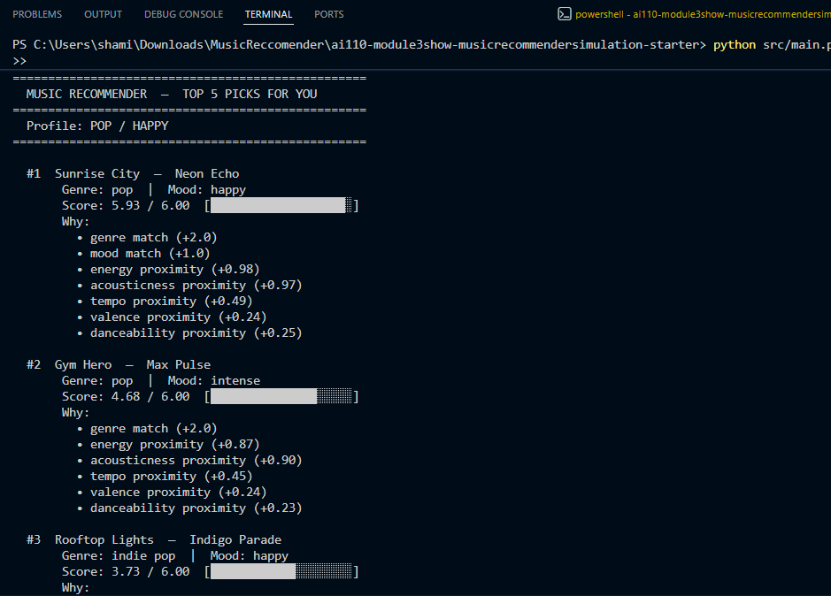
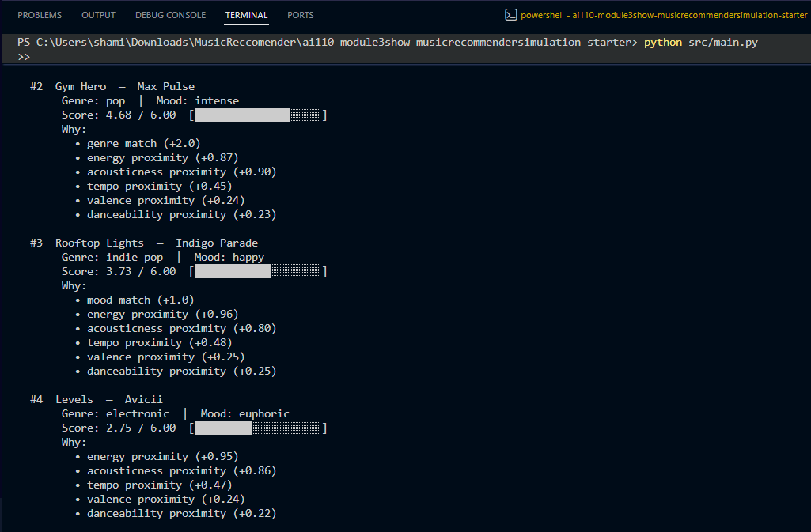
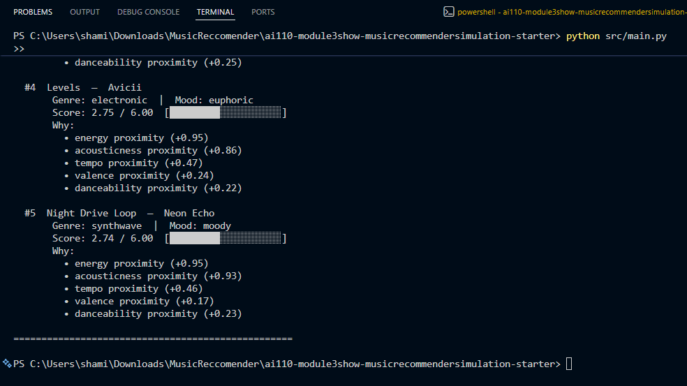

# 🎵 Music Recommender Simulation

## Project Summary

In this project you will build and explain a small music recommender system.

Your goal is to:

- Represent songs and a user "taste profile" as data
- Design a scoring rule that turns that data into recommendations
- Evaluate what your system gets right and wrong
- Reflect on how this mirrors real world AI recommenders

Replace this paragraph with your own summary of what your version does.

---

## How The System Works

Explain your design in plain language.
The system works by each song storing id, title, artist, genre, mood, energy, tempo_bpm, valence, danceability, and acousiticness. The user profile stores a target value for each of the features and a preferred genre and mood. The recommender scores each song using two steps. The first step is to check for the exact category matches, for example, genre earsn up to 1.0 point. Second, it measures how close the song's numeric value is to the user's targets. For example, energy earns up to 2.0 points, acousticness up to 1.0, tempo up to 0.5, and valence and danceability are up to 0.25 each. The total max is 6.0 points. The songs are sorted from highest to lowest, and it gives the top 5 songs.

Some prompts to answer:

- What features does each `Song` use in your system
  - For example: genre, mood, energy, tempo
- What information does your `UserProfile` store
- How does your `Recommender` compute a score for each song
- How do you choose which songs to recommend

You can include a simple diagram or bullet list if helpful.

---

## Getting Started

### Setup

1. Create a virtual environment (optional but recommended):

   ```bash
   python -m venv .venv
   source .venv/bin/activate      # Mac or Linux
   .venv\Scripts\activate         # Windows

2. Install dependencies

```bash
pip install -r requirements.txt
```

3. Run the app:

```bash
python -m src.main
```

### Running Tests

Run the starter tests with:

```bash
pytest
```

You can add more tests in `tests/test_recommender.py`.

---

## Experiments You Tried

I tried the weight shift and noticed that the max score stayed at 6.0, so the math remained valid. For profiles like lofi and pop, the top results barely changed. For the rock profile, the high-energy songs from other genres went up to the top 5, even without a genre match, because their energy proximity earned up to 2.0 on its own. This showed me that the genre weight is only meaningful when the catalog has enough songs in that genre.
Use this section to document the experiments you ran. For example:

- What happened when you changed the weight on genre from 2.0 to 0.5
- What happened when you added tempo or valence to the score
- How did your system behave for different types of users

---

## Limitations and Risks

Summarize some limitations of your recommender.
- Does not consider lyrics, languages, or any cultural context 
- Only works on a cataloh of 20 songs 
- A lot of the energy values are in two extremes, and nothing is in the middle, so any middle energy users get bad matches.

Examples:

- It only works on a tiny catalog
- It does not understand lyrics or language
- It might over favor one genre or mood

You will go deeper on this in your model card.

---

## Reflection

Read and complete `model_card.md`:

[**Model Card**](model_card.md)

Write 1 to 2 paragraphs here about what you learned:

Building this recommender showed that a prediction is just how similarity is turned into a number. The system itself does not know what good music is. It only knows how far each song is from a target. All the design choices I made like giving the genre more weight than tempo is what influenced which songs appeared at the top. The bias or unfairness showed when there were more lofi songs than any other genre which means that lofi has more changes to earn the genre bonus while metal or blues users does not. Also, there were no songs that were in the middle energy range so any users that wanted that has no good matches.


- about how recommenders turn data into predictions
- about where bias or unfairness could show up in systems like this


---

## 7. `model_card_template.md`

Combines reflection and model card framing from the Module 3 guidance. :contentReference[oaicite:2]{index=2}  

```markdown
# 🎧 Model Card - Music Recommender Simulation

## 1. Model Name

InTune

Give your recommender a name, for example:

> VibeFinder 1.0

---

## 2. Intended Use

InTune suggests songs from a small catalog based on a user's preferred genre, mood, and audio features like energy and acousticness.

- What is this system trying to do
- Who is it for

Example:

> This model suggests 3 to 5 songs from a small catalog based on a user's preferred genre, mood, and energy level. It is for classroom exploration only, not for real users.

---

## 3. How It Works (Short Explanation)

Describe your scoring logic in plain language. 

Every song in the catalog gets a score out of 6. The score is built from seven features. If the song's genre matches your favorite genre,  it earns 1 point. If the mood matches, it earns 1 more point. The remaining points come from how close the song audio values are. The songs are sorted from highest to lowest, and the top 5 are shown.

Features:
1. Genre
2. Mood
3. Energy
4. Acousticness
5. Tempo
6. Valence
7. Danceability

- What features of each song does it consider
- What information about the user does it use
- How does it turn those into a number

Try to avoid code in this section, treat it like an explanation to a non programmer.

---

## 4. Data

Describe your dataset.

There are 20 songs, and originally there were only 10, so I added 10 more songs. The genres are pop, lofi, ambient, jazz, synthwwave, indie pop, hip hop, classical, R&B, electronic, folk, metal, reggae, soul, country, and blues. The moods were happy, chill, intense, relaxed, focused, moody, euphoric, peaceful, romantic, melancholic, angry, nostalgic, and sad. The taste was towards Western music. 

- How many songs are in `data/songs.csv`
- Did you add or remove any songs
- What kinds of genres or moods are represented
- Whose taste does this data mostly reflect

---

## 5. Strengths

Where does your recommender work well

The system works best for lofi and pop users because those genres have more than one song. The scoring also does a reasonable job of cross-genre discovery. Every recommendation comes with a clear explanation of how the score was made, making the system easier to understand. 

You can think about:
- Situations where the top results "felt right"
- Particular user profiles it served well
- Simplicity or transparency benefits

---

## 6. Limitations and Bias

Where does your recommender struggle

The biggest weakness is that most genres only have one song. If you like metal, there is only one metal song that the system can recommend to you. After that, it only picks whatever sounds closest to your other preferences. This means a lot of metal fans and a lofi fan can end up with similar songs at the bottom of their list, even if their taste are different. There is also a gap when it comes to energy value between 0.62 and 0.74, with no songs in that range. 

Some prompts:
- Does it ignore some genres or moods
- Does it treat all users as if they have the same taste shape
- Is it biased toward high energy or one genre by default
- How could this be unfair if used in a real product

---

## 7. Evaluation

How did you check your system

I tested on 6 user profiles. A high-energy pop lover got Sunrise City at the top, which makes sense since it is the only pop song that is also happy and energetic. A chill lofi listener got Midnight Coding first, which was expected. A rock listener got Storm Runner first since it is the only rock song. 

The last 3 were made to break the system. The first one had a sad mood, but wanted very high energy, which is a contradiction. No song could satisfy both at the same time, so every result had a weak score. The second one had a favorite genre that does not exist, so the system ignored the genre preference and recommended songs based on audio features without telling the user the genre was missing. The third one had every preference set to the middle value. Since everything was neutral, almost every song was scored the same, and the results felt random. 

I also tested what happened when I changed the scoring weight. I made energy worth double and genre worth half. For lofi and pop users, nothing changed at the top, but for rock users, high-energy songs from completely different genres started to appear in the top 5 just because their energy was close enough.

Examples:
- You tried multiple user profiles and wrote down whether the results matched your expectations
- You compared your simulation to what a real app like Spotify or YouTube tends to recommend
- You wrote tests for your scoring logic

You do not need a numeric metric, but if you used one, explain what it measures.

---

## 8. Future Work

If you had more time, how would you improve this recommender

- The recommender system should be able to reject bad matches rather than always returning something, even if it doesn't match. 
- Genre matching should give partial points for similar genres instead of zero
- Adding more songs per genre would make the recommendation more useful 

Examples:

- Add support for multiple users and "group vibe" recommendations
- Balance diversity of songs instead of always picking the closest match
- Use more features, like tempo ranges or lyric themes

---

## 9. Personal Reflection

Writing the scoring code felt easy, but when testing it, I realized the system was giving bad recommendations to users who liked metal or blues because those genres had only one song in the catalog. The code was doing what it was supposed to do, but the results were still unfair. The output of my code looked very convincing, even though the system was simple. Before this project, I always wondered how apps like Spotify were recommending songs, and now I know they are just measuring distance. Every song gets compared to a target, and the closest one wins. There is no taste, no feeling, and no understanding of what makes a song good. It is just numbers being sorted. 

A few sentences about what you learned:

- What surprised you about how your system behaved
- How did building this change how you think about real music recommenders
- Where do you think human judgment still matters, even if the model seems "smart"

```
## CLI Verification 



